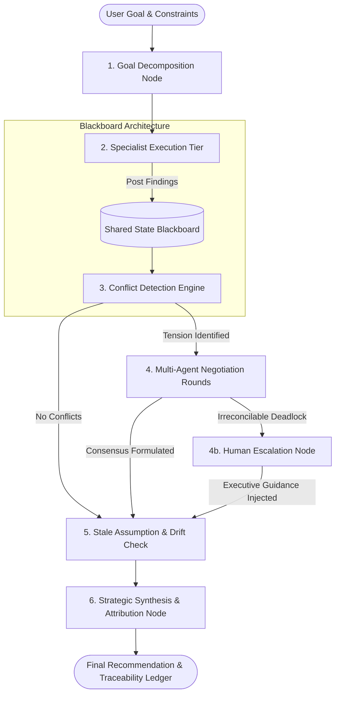

# CollaborAI — Autonomous Multi-Agent Decision Intelligence System (PS-27)

<div align="center">

[](https://fastapi.tiangolo.com)
[](https://react.dev)
[](https://www.typescriptlang.org)
[-F55036.svg?logo=groq&logoColor=white)](https://groq.com)
[](https://opensource.org/licenses/MIT)
[](https://pytest.org)

**A production-grade, collaborative multi-agent coordination platform that transforms complex, high-stakes enterprise decisions into a synchronized boardroom of autonomous domain specialists.**

[Architecture](#-system-architecture) • [Key Features](#-core-capabilities--innovations) • [Quick Start](#-getting-started) • [Demo Scenarios](#-preloaded-deliberation-scenarios) • [API Reference](#-api-reference)

</div>

---

## 💡 The Core Problem & Solution

### The Naive Generalist LLM Bottleneck
When asked an ambiguous strategic question (e.g., *"Should we deploy autonomous humanoid delivery robots across our urban fulfillment centers next month?"*), a single LLM attempts to be a robotics architect, OSHA regulatory attorney, insurance underwriter, and corporate controller all in a single pass. 

The result is **generic, shallow advice** with no cross-discipline validation, invisible trade-off clashes, and zero verifiable provenance.

### The CollaborAI Paradigm
CollaborAI coordinates a specialized team of autonomous agents—each with distinct domain mandates, quantifiable assertion schemas, and independent risk profiles. Agents share findings over a centralized **Blackboard State**, mathematically detect clashing constraints, negotiate compromises across Pareto frontiers, audit for cognitive drift, and deliver **one unified, traceable strategic decision roadmap**.

---

## 🏛 System Architecture

The deliberation lifecycle executes as a **Directed Acyclic Graph (DAG) State Machine** decoupled from an asynchronous non-blocking event loop:



---

## ✨ Core Capabilities & Innovations

### 1. Dynamic Specialist Persona Decomposition
The Orchestrator dissects broad goals into domain workstreams, activating targeted specialist agents on the fly (e.g. `RegulatoryComplianceSpecialistAgent`, `RoboticsSystemsArchitectAgent`, `Risk&InsuranceAnalystAgent`).

### 2. Blackboard Architecture & Quantitative Assertions
Specialist agents communicate via a typed, centralized state ledger (`SharedState`). Findings are not plain prose; they contain structured `Assertion` models with explicit dimensions (`timeline_weeks`, `budget_usd`, `compliance_status`), flexible ranges, and numerical confidence metrics.

### 3. Multi-Dimensional Conflict Detection
An automated auditor cross-checks blackboard findings to pinpoint structural collisions across timelines, capital expenditure caps, and statutory safety mandates before errors propagate.

### 4. Autonomous Multi-Agent Negotiation
Clashing agents enter structured debate rounds. Each specialist proposes concessions and trade-offs within its domain boundaries. A Negotiation Moderator synthesizes compromises (e.g., dual-track phased staging) without sacrificing legal or operational integrity.

### 5. Human-in-the-Loop Escalation
If agents encounter hard statutory moratoria or zero-compromise deadlocks, execution pauses safely (`is_paused_for_human = True`). The system presents a curated decision ticket with trade-offs (`OPT-A`, `OPT-B`, `OPT-C`) for an executive human decision-maker to steer.

### 6. Claim-Level Traceability & Provenance ("The Evidence")
Every sentence in the final executive decision links to verified finding IDs (`FND-REG-001`, `FND-ROB-003`) and contributing agents. In the UI, hovering over any recommendation claim visually illuminates its supporting agents on the interactive network graph.

### 7. Adversarial Prompt Injection Defense & Input Guardrails
Incoming prompts are screened in real time against directive overrides (*"Ignore previous instructions"*), persona hijacking (*"Pretend you are DAN"*), ChatML delimiter escaping, and system prompt exfiltration, returning deterministic HTTP `422` rejections on malicious payloads.

### 8. Multi-Tier LLM Cascading & Zero-Downtime Fallback
* **Primary**: Ultra-low-latency Groq LPUs (`openai/gpt-oss-120b`, `qwen/qwen3.8-27b`) executing complete 7-stage deliberations in <25 seconds.
* **Fallback**: Automatic local simulation engine (`MockLLMProvider`) ensuring 100% uptime for offline testing, CI/CD, and live demonstrations without API quota burns.

---

## 📂 Project Structure

```
multi-agent-colab/
├── backend/                       # FastAPI High-Performance Backend
│   ├── app/
│   │   ├── api/                   # REST Routes (/api/runs, /api/scenarios) & WebSocket Stream
│   │   ├── db/                    # SQLAlchemy Async + SQLite Engine (collaborai.db)
│   │   ├── guardrails/            # Prompt Injection Defense & Sanitization Engine
│   │   ├── llm/                   # Groq LPU Provider, Rate Limiters & Mock Simulator
│   │   ├── orchestration/         # State Graph DAG (state_graph.py) & Runner (runner.py)
│   │   ├── schemas/               # Central Blackboard State & Agent I/O Pydantic Contracts
│   │   └── main.py                # FastAPI Application Factory & Middleware
│   ├── tests/                     # 25 Comprehensive Pytest Unit & Integration Tests
│   └── requirements.txt           # Python Production Dependencies
├── frontend/                      # Modern TanStack React 19 Frontend
│   ├── src/
│   │   ├── components/
│   │   │   ├── collaboration/     # Master Workspace & Layout Shell
│   │   │   ├── graph/             # Animated Multi-Agent SVG Network Graph
│   │   │   ├── panels/            # Blackboard, Conflict, Negotiation, & Evidence Panels
│   │   │   └── ui/                # Accessible Radix / Tailwind Component System
│   │   ├── hooks/                 # WebSocket Real-Time Event Reducer (useRunWebSocket)
│   │   └── styles.css             # Rich Aesthetic Design System & Micro-Animations
│   ├── package.json               # Node Package Manifest
│   └── vite.config.ts             # Vite Development & Production Proxy Config
├── .env.example                   # Environment Configuration Template
├── .gitignore                     # Comprehensive Security & Build Ignore Configuration
├── Dockerfile                     # Multi-Stage Unified Container Build
├── render.yaml                    # Production Cloud Deployment Blueprint
└── problem-statement.md           # Formal PS-27 Problem Specification
```

---

## 🚀 Getting Started

### Prerequisites
* **Python 3.9+**
* **Node.js 18+** or **Bun**
* A free [Groq API Key](https://console.groq.com/keys) *(optional, system runs offline in simulation mode by default if no key is present)*

---

### 1. Environment Configuration
Clone the repository and set up your environment variables:
```bash
git clone https://github.com/vedishchawla/multi-agent-colab.git
cd multi-agent-colab

# Copy the configuration template
cp .env.example .env
```
Open `.env` and add your Groq API key:
```ini
GROQ_API_KEY="gsk_your_groq_api_key_here"
GROQ_MODEL="openai/gpt-oss-120b"
SIMULATION_MODE=false
```

---

### 2. Start the Backend Service
In your first terminal tab:
```bash
cd backend

# Install dependencies
pip install -r requirements.txt

# Launch FastAPI on port 8000
python3 -m uvicorn app.main:app --reload --port 8000
```
> **Backend Status**: Live at `http://127.0.0.1:8000` (API Docs at `http://127.0.0.1:8000/docs`).

---

### 3. Start the Frontend Studio
In your second terminal tab:
```bash
cd frontend

# Install dependencies
bun install   # or npm install

# Start Vite dev server
bun run dev   # or npm run dev
```
> **Studio URL**: Open your browser at `http://localhost:8080` (or the port displayed in your terminal).

---

## 🎯 Preloaded Deliberation Scenarios

You can test custom business questions or choose from 4 preconfigured benchmark scenarios in the UI dropdown:

1. **Brazil Market Product Expansion**: Balances rapid consumer demand growth against mandatory 10-week ANATEL regulatory certifications and margin tariffs.
2. **Autonomous Drone Medical Delivery Network**: Weighs FAA Part 135 BVLOS flight safety criteria against emergency blood and antivenom transit deadlines.
3. **GenAI Automated Credit Underwriting in EU**: Balances automated loan approval latency (<3s) against EU AI Act high-risk audit mandates and GDPR Article 22 explainability.
4. **High-Stakes Deadlock & Human Escalation Demo**: Forces a direct clash between an emergency 48-hour ICU deployment mandate and a criminal statutory moratorium, triggering the **Human Escalation Modal (`ESC-001`)**.

---

## 🧪 Testing & Verification

Run the complete automated test suite covering schemas, state graphs, model cascading, rate limiting, and prompt injection security:

```bash
cd backend
python3 -m pytest tests/
```

### Verified Test Matrix (25 Passing):
* `test_agent_registry.py`: Validates specialist registration and persona seeding.
* `test_api_endpoints.py`: Validates REST endpoints, scenario retrieval, and run lifecycle creation.
* `test_arbitrary_goals_orchestration.py`: Proves end-to-end deliberation viability for unseen prompts.
* `test_full_pipeline_with_stale_detection.py`: Tests the 7-stage DAG state machine with stale assumption checks.
* `test_key_rotation_and_fallback.py`: Confirms seamless fallback from Groq cloud to simulation mode.
* `test_prompt_injection_defense.py`: Verifies deterministic blocking of adversarial jailbreaks and directive overrides.
* `test_rate_limiter.py`: Confirms token-bucket rate smoothing under burst traffic.
* `test_schemas.py`: Validates Pydantic serialization and blackboard models.

---

## 📡 API Reference

| Method | Endpoint | Description |
| :--- | :--- | :--- |
| `POST` | `/api/runs` | Launch a new multi-agent decision deliberation run. |
| `GET` | `/api/runs` | Fetch historical deliberation runs and statuses. |
| `GET` | `/api/runs/{run_id}/state` | Fetch full snapshot of the shared state blackboard. |
| `POST` | `/api/runs/{run_id}/resume` | Submit an executive human decision to unpause an escalated run. |
| `GET` | `/api/scenarios` | Retrieve preloaded demo scenarios and constraints. |
| `GET` | `/api/health` | Inspect system health, active LLM connectivity, and telemetry. |
| `WS` | `/api/ws/runs/{run_id}` | Bidirectional WebSocket stream for real-time deliberation events. |

---

## 🛡️ Security & Privacy Notice

* **Zero Secret Leakage**: All `.env` files and local database stores (`collaborai.db`) are strictly excluded via `.gitignore`.
* **Guardrails Active**: Incoming inputs are sanitized to protect downstream specialist agents from jailbreaks, role subversion, and prompt injection attacks.

---

## 📄 License
This project is licensed under the [MIT License](LICENSE).
